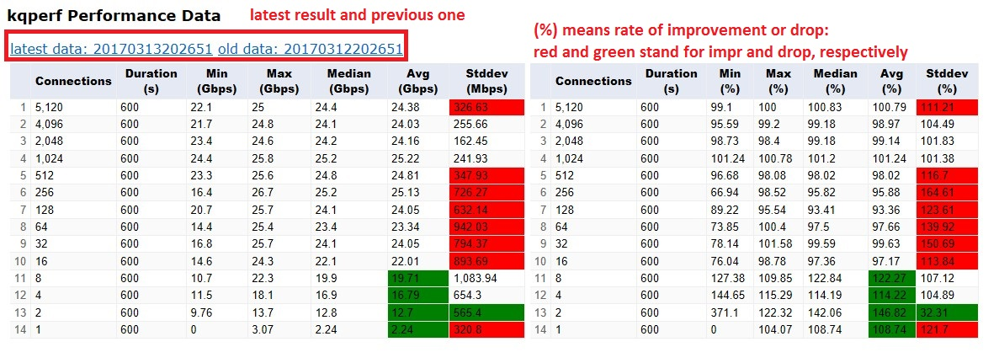

# Why 
For FreeBSD kernel development, no good tool is found to automatically track the network or storage performance. The scripts want to help FreeBSD developers/testers to build a performance test harnesses, which were mainly developed through bash, and ideally it can be adapted to Linux. The test framework is designed to be configurable, modularization, data analysis oriented, and auto-visualization with the help of rich helper functions.
# Audience
Developers, testers, or administrators on BSD OS or Linux, who want to manage or track performance of the network or storage products. It can be used in the following scenarios:
* Daily performance track for network and storage perfomance. It was scheduled by Jenkins every day.
* Self-service performance test. It is used by developers whose CI may impact on performance, and the perf test can tell how much perf was improved or dropped.
* FreeBSD on Azure performance test. It is run only at release stage. Those perf numbers are useful when we help vendors to solve their perf issue.
# How rocket performance works
## Modularization, Auto-visualization, Easy-extended
The test framework targets to evalute the performance of network and storage. It was composed by engine, helper functions, and modules.

According to the characteristics of this kind of test mechanism and results presentation, the framework creates a lot of helper functions to prepare the test environment, automatically generate the test runners, parse the raw results and generate visual data through Google Chart API. Those helper functions are defined in perf_env.sh, and referred by the main functions in engine run.sh and run_jenkins.sh.

The test drivers are modularized and configurable. There are different kinds of network or storage perf tools, for example, in network field, iperf is widely used but it suffers from threading issue, so netperf and kqperf were invented. Network test tools have similar input/output, thus the logic for running them and visualizing result can be shared between those tools. The similiar thing also happened in storage tools. All of those test modules can be found in config folder.

The engine (main function in run.sh or run_jenkins.sh) is responsible to read configuration and launch the corresponding test module, collect result data, parse the raw data and generate CSV or HTML for final visualization. During the process, it can refer the helper functions.

The configuration data or global variables can be specified by directly written down in server_env.sh or customized by Jenkins (for_jenkins.sh).

Every module's logic can be found from config folder. For example, kqperf contains all instructions:
* reboot two machines 
* configure the internal IP on both machines
* set some sysctl tunable options if they are set
* create start timestamp
* distribute the test driver to those machines
* launch the test netperf server on receiving end
* set the total duration for the running
* start the script by "run_netdrv_kqnetperf"
* create end timestamp
* generate HTML page from results and move it to result directory
* generate CSV data and move it to result directory
All the functions used can be found from perf_env.sh

New tool packages used here: kq_netperf and netperf:
* kq_netperf.tgz/kq_sendrecv.tar 
They are multiple threading, event driven and high performance network tools based on FreeBSD KQueue.
* tcp_stream.tbz
It is a tar ball which is another network perf tool with support of multiple threading. It is a wrapper of netperf, but it suffered an issue when the connection exceeds 4096.
# How to use it
## Requirement
All of those tools or scripts are verified under FreeBSD 10.2, 10.3, 11.0 and HEAD. It requires the following pkg:
* python2.7
* fio
* netperf
* iperf (option)
* sendmail

Set some global configurations:
* auto_build:       automatically build the kernel
* run_netperf:      run netperf test or not
* run_kqperf:       run kqperf test or not
* run_ntttcp:       run ntttcip test or not
* run_fio:          run FIO test or not
* run_sysbench:     run sysbench or not
* run_sio:          run SIO or not
* run_iperf:        run iperf or not
* receivers_list:   the mail receiver list
* connection_iter:  the connections for network perf test
* mailclient:       send result through another VM server
* use_mailclient:   whether the mail was sent through another VM.
## Network Perf
For network test, it requires two direct-connected FreeBSD machines. Those machines have at least 2 NICs. one of them was used to external connection, another is used to connect the other machine.
1. Some global variables:
* config_internal_ip:  automatically configure internal IP or not, if yes, please specify the internal IP in the following
* choose_NUMA:         Considering NUMA impact for VM, it wants to know which NUMA node do you prefer. Please ignore it if you do not run it on VM.
* need_reboot:         It is a global control for the function reboot_XXX
* internal_nic:        The NIC used for internal network perf test.
2. Please specify the two machines' external and internal IP and port. the dummy servers are used as a placeholder to configure NUMA. Please ignore them if you do not run it on VMs.
* sending side:
perf04_corp_ip:   external IP
perf04_inter_ip:  internal IP
* receiving side:
perf03_corp_ip:   external IP
perf03_inter_ip:  internal IP

## Storage Perf
Specify the storage related configurations:
* disk_part:      disk partition used for storage test
* fio_engine:     specify the fio engine.
## Result
A demo can be found: http://freebsd.southeastasia.cloudapp.azure.com
Explanation for the result:

